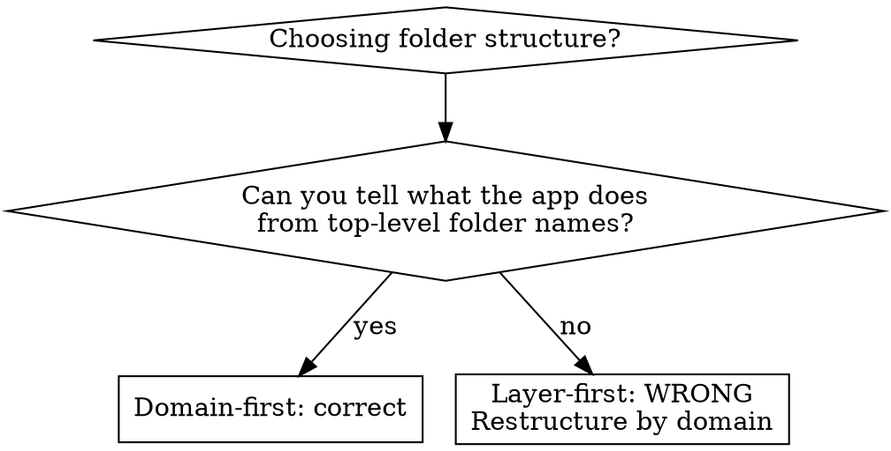

# Service Oriented Architecture

Architectural guidelines for building services with Clean Architecture principles. Language-agnostic, with Python as the reference language.

**Core principle:** Source code dependencies must point only inward, toward higher-level policies. Nothing in an inner circle can know anything about something in an outer circle.

## When to Use

- Building a new API or web service
- Adding endpoints, clients, or persistence to an existing service
- Integrating external APIs or third-party services
- Structuring or restructuring a project
- Reviewing architecture decisions

## When NOT to Use

- One-off scripts or CLI tools
- Prototypes explicitly marked as throwaway
- Libraries (not deployed services)

## The Architecture Onion

Three layers, strict dependency direction: **API -> Domain <- Infrastructure**

```
┌─────────────────────────────────────────────┐
│  Outer: API Layer (routers, consumers)      │
│  ┌─────────────────────────────────────────┐│
│  │  Outer: Infrastructure (clients, DBs)   ││
│  │  ┌─────────────────────────────────────┐││
│  │  │  Inner: Domain (entities, services) │││
│  │  └─────────────────────────────────────┘││
│  └─────────────────────────────────────────┘│
└─────────────────────────────────────────────┘
```

- The **Domain layer** is the most abstract and stable. It defines entities, services, and protocols. It knows nothing about HTTP, databases, or external APIs.
- The **Infrastructure layer** implements domain protocols. It contains concrete clients, database classes, and mappers to/from domain entities.
- The **API layer** is the most concrete and unstable. It handles HTTP request/response models, routing, and maps between API models and domain entities.

**Dependency rule:** Inner layers NEVER import from outer layers. The domain defines abstract protocols; infrastructure implements them. The API layer consumes domain services.

## Screaming Architecture

**Top-level folders are named by domain, not by technical concern.** The folder structure should scream what the application does, not what framework it uses.



### Example: Domain-First Structure

```
src/
  profiles/
    router.py
    service.py
    mapper.py                   # API <-> Domain mapping
    exceptions.py
    dependencies.py
    facade.py                   # abstract protocol (domain-level)
    dao.py                      # abstract persistence protocol (domain-level)
    model/
      api/
        requests.py
        responses.py
      profile.py                # domain entity
    client/
      fellow_client.py          # concrete client (implements facade)
      fellow_client_mapper.py   # provider JSON <-> domain entity
    persistence/
      profile_db.py             # concrete DB (implements dao)
      profile_dto.py            # DB row representation
      profile_db_mapper.py      # DTO <-> domain entity
  schedules/
    router.py
    service.py
    model/
      ...
    ...
  device/
    ...
  config.py
  main.py
```

Each top-level domain folder is a self-contained mini-API. If you were to extract it into its own service, you would only need to replace direct service calls with HTTP interfaces or event queues.

**Anything outside a domain folder** is a candidate for a common library: global config, database connection setup, abstract base classes shared across domains.

## Class Types and Naming Conventions

Consistent suffixes make it immediately obvious what a class does.

### Entities

The most abstract models. Domain representations of business concepts. They sit at the inner core of the onion. They depend on nothing from outer layers.

```python
# profiles/model/profile.py
@dataclass(frozen=True)
class Profile:
    id: str
    title: str
    ratio: float
    bloom_enabled: bool
    # ... domain fields only, no HTTP or DB concepts
```

### Services (suffix: `*Service`)

Encapsulate business logic as use cases on domain entities. They depend on abstract protocols (DAOs, Facades), never on concrete infrastructure. They are the technical translation of product requirements.

```python
# profiles/service.py
class ProfileService:
    def __init__(
        self,
        profile_dao: ProfileDAO,           # abstract, not concrete DB
        fellow_facade: FellowClientFacade, # abstract, not concrete client
    ) -> None: ...

    async def create_profile(self, request: ProfileCreateRequest) -> ProfileCreateResult:
        # Business logic here. No HTTP concepts, no DB queries.
        ...
```

Services return **typed outcomes**, not exceptions:

```python
class ProfileCreateOutcome(Enum):
    SUCCESS = "success"
    NOT_FOUND = "not_found"
    UPSTREAM_UNAVAILABLE = "upstream_unavailable"

@dataclass
class ProfileCreateResult:
    outcome: ProfileCreateOutcome
    profile: Profile | None = None
    error: str | None = None
```

### Mappers (suffix: `*Mapper`)

Map one object to another across layer boundaries. Essential for decoupling. Without them, a new field in one layer propagates changes to every layer.

```python
# profiles/mapper.py
class ProfileMapper:
    @staticmethod
    def to_api_response(profile: Profile) -> ProfileAPIResponse:
        return ProfileAPIResponse(
            id=profile.id,
            title=profile.title,
            ...
        )

    @staticmethod
    def from_api_request(request: ProfileCreateAPIRequest) -> ProfileCreateRequest:
        return ProfileCreateRequest(
            title=request.title,
            ...
        )
```

**Where mappers live:**
- API <-> Domain mapping: in the domain folder's `mapper.py` (visible to router and service)
- Infrastructure <-> Domain mapping: **internal to the infrastructure class**. Lives in `client/` or `persistence/` alongside the concrete implementation. The service never sees infrastructure mappers -- it only deals with domain entities.

### Clients and Facades (suffix: `*Client`, `*Facade`)

Clients are concrete classes that talk to external APIs. They sit on the outer layer. **Services must never depend on clients directly.**

Facades are abstract protocols that define what the domain needs from the outside world. **They live at the domain level** (e.g., `profiles/facade.py`), not alongside the concrete client. This ensures the dependency arrow points inward -- the domain defines the contract, infrastructure implements it.

```python
# profiles/facade.py (domain level -- defines what the domain needs)
class FellowClientFacade(Protocol):
    async def create_profile(self, profile: Profile) -> Profile: ...
    async def get_profiles(self) -> list[Profile]: ...

# profiles/client/fellow_client.py (infrastructure -- implements the facade)
class FellowClient(FellowClientFacade):
    def __init__(self, settings: Settings, mapper: FellowClientMapper) -> None: ...

    async def create_profile(self, profile: Profile) -> Profile:
        request = self._mapper.to_api_request(profile)
        response = await self._http.post("/profiles", json=request)
        return self._mapper.from_api_response(response.json())
```

**Why Facades?** If a third-party dependency updates their API, you create a new Client that implements the same Facade and swap it in your DI wiring. The service layer is untouched. This also makes testing trivial -- your mock just implements the Facade.

**Infrastructure mappers are internal.** The `FellowClientMapper` lives inside `client/` and is used only by `FellowClient`. The service never sees it -- the client accepts and returns domain entities only.

### Routers and Consumers

Routers handle inbound HTTP. Consumers handle inbound events. Both sit on the outer layer. They map API models to domain models, call services, and map results back to API responses.

```python
# profiles/router.py
@router.post("/profiles", status_code=201)
async def create_profile(
    request: ProfileCreateAPIRequest,
    service: ProfileService = Depends(get_profile_service),
    mapper: ProfileMapper = Depends(get_profile_mapper),
) -> ProfileCreateAPIResponse:
    domain_request = mapper.from_api_request(request)
    result = await service.create_profile(domain_request)

    match result.outcome:
        case ProfileCreateOutcome.SUCCESS:
            return mapper.to_api_response(result.profile)
        case ProfileCreateOutcome.NOT_FOUND:
            raise HTTPException(status_code=404, detail=result.error)
        case ProfileCreateOutcome.UPSTREAM_UNAVAILABLE:
            raise HTTPException(status_code=503, detail="Upstream service unavailable")
```

**Routers are thin.** They map, delegate, and map back. No business logic.

### DB/DAO (suffix: `*DB`, `*DAO`)

DAOs are abstract protocols defining persistence operations. **They live at the domain level** (e.g., `profiles/dao.py`), not inside `persistence/`. DBs are concrete implementations that live in `persistence/`. Services depend on DAOs, never on DBs.

```python
# profiles/dao.py (domain level -- defines what the domain needs)
class ProfileDAO(Protocol):
    async def create(self, profile: Profile) -> None: ...
    async def get_by_id(self, profile_id: str) -> Profile | None: ...

# profiles/persistence/profile_db.py (infrastructure -- implements the DAO)
class ProfileDB(ProfileDAO):
    def __init__(self, session: AsyncSession, mapper: ProfileDTOMapper) -> None: ...

    async def create(self, profile: Profile) -> None:
        dto = self._mapper.to_dto(profile)
        self._session.add(dto)
        await self._session.commit()
```

**Infrastructure mappers are internal.** The `ProfileDTOMapper` lives inside `persistence/` and is used only by `ProfileDB`. The service never sees DTOs or DB mappers -- it passes and receives domain entities only.

## Six Architectural Principles

These SOLID-for-APIs principles govern how components are built and split.

### Component Cohesion

1. **Reuse/Release Equivalence (REP):** Modules grouped together must share an overarching theme and be releasable together.
2. **Common Closure (CCP):** Gather classes that change for the same reasons and at the same rate. Separate classes that change for different reasons.
3. **Common Reuse (CRP):** Don't force users of a component to depend on things they don't need.

### Component Coupling

4. **Acyclic Dependencies (ADP):** No cycles in the dependency graph. Use dependency inversion (protocols) to break cycles.
5. **Stable Dependencies (SDP):** Depend in the direction of stability. Volatile components (API layer) depend on stable components (domain), never the reverse.
6. **Stable Abstractions (SAP):** A component should be as abstract as it is stable. Stable components should be extensible through abstraction.

## Separate Models Per Layer

**Be DRY within your components, not between them.**

Each layer has its own models. Even if they look identical today, they change at different rates and for different reasons.

| Layer | Model type | Example | Purpose |
|-------|-----------|---------|---------|
| API | Request/Response | `ProfileCreateAPIRequest` | HTTP contract with callers |
| Domain | Entity | `Profile` | Core business object |
| Infrastructure (DB) | DTO | `ProfileDTO` | Database row representation |
| Infrastructure (Client) | API models | `FellowProfileRequest` | External API contract |

**Never share a single model across layers.** This is the most common violation. Rationalizations include:

| Rationalization | Reality |
|----------------|---------|
| "The models are identical" | They are identical *today*. They will diverge. |
| "It's just duplication" | It's intentional decoupling. DRY applies within components, not between layers. |
| "It's premature abstraction" | It's not abstraction, it's isolation. The cost is a few lines of mapping. The cost of NOT doing it is coupled layers that break together. |
| "Keep it simple" | Coupled layers are not simple. They are easy to start and hard to change. |

## Common Mistakes

### Putting the Protocol alongside the concrete class

Protocols/Facades define what the domain needs. They live at the domain level (`facade.py`, `dao.py`), **not** inside `client/` or `persistence/` next to the infrastructure implementation. This ensures the dependency arrow points inward. If the protocol lives next to the concrete class, the domain imports from infrastructure -- a direct violation.

### Using `dict` as an intermediate format

Typed domain entities are the lingua franca between layers, not dicts. A dict-based intermediate format is untyped, invisible to the type checker, and creates an implicit contract that nobody can verify.

### Skipping mappers for "simple" cases

If two layers exchange data, there is a mapper. Even if the mapping is trivial today. The mapper is where future divergence will be handled. Without it, a schema change in one layer cascades to every other layer.

### Layer-first folder structure

```
# WRONG - can't tell what this app does
src/
  routers/
  services/
  models/
  clients/

# RIGHT - this is a weather API
src/
  weather/
  forecast/
  alerts/
```

## Testing

Tests mirror the domain structure:

```
tests/
  profiles/
    test_router.py        # e2e: hits endpoints via test client
    test_service.py       # unit: mock DAO and Facade
    test_fellow_client.py # unit: mock HTTP (respx)
  schedules/
    ...
```

- **Router tests** are integration/e2e tests: they hit endpoints through the full stack
- **Service tests** are unit tests: inject mock DAOs and Facades
- **Client tests** are unit tests: mock HTTP calls at the transport level
